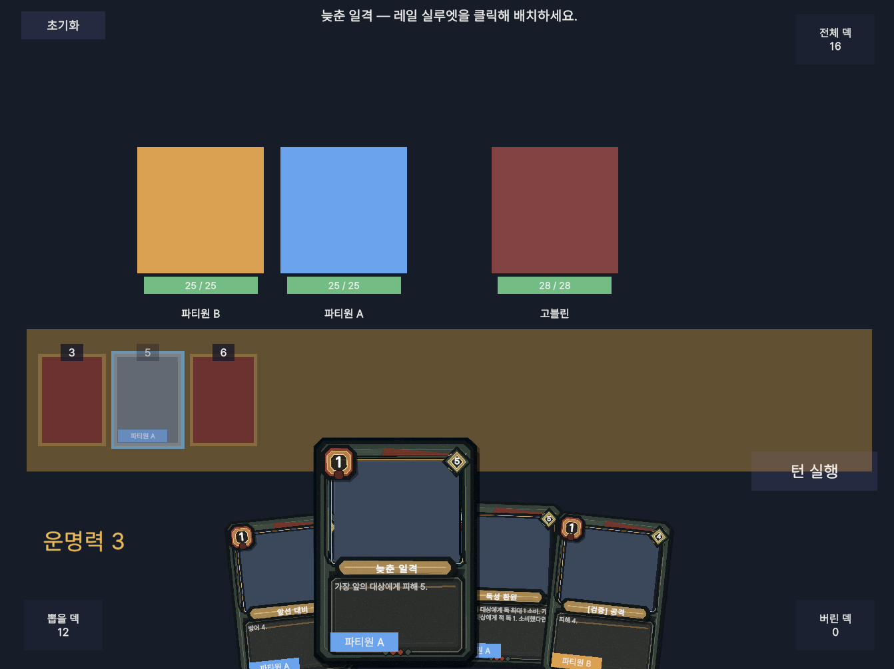

# Rogue-deck (가제)

**Rogue-deck**은 카드의 실행 순서를 자원으로 다루는 턴제 덱빌딩 로그라이크입니다. 적의 다음 수가 전부 공개된 채로 턴이 시작됩니다. 손패를 실행선에 올리고, 조작 카드로 그 순서를 비틀고, 함께 싸울 사람을 골라 덱을 키웁니다.

이기는 방법은 더 센 카드를 뽑는 것이 아닙니다. **닥쳐올 미래를 읽고 그 배치를 바꾸는 것**입니다.

턴이 시작되면 적이 이번 턴에 할 일이 실행선 위에 공개됩니다. 정해지지 않은 것은 플레이어 쪽입니다. 손에 든 카드 중 무엇을 그 줄에 올릴지, 그리고 이미 늘어선 줄을 어떻게 비틀지.

그리고 런은 이어집니다. 전투가 끝나면 보상 카드가 펼쳐지는데, 거기 오르는 이름들은 지금 곁에 있는 사람들의 것입니다. 독을 다루는 이와 함께 걸으면 덱에 독이 고이고, 순서를 비트는 데 능한 이를 들이면 손패가 유연해집니다. 덱은 카드를 주워 모아서가 아니라 **누구와 함께 싸울지 골라서** 만들어집니다.

언젠가 그중 하나가 쓰러집니다. 또는 자리를 비워 달라고 말해야 할 때가 옵니다. 그가 가져온 카드는 덱에서 통째로 사라지지만, 대가를 치르면 그가 남긴 것 중 일부를 덱에 붙잡아 둘 수 있습니다. 더 치를수록 더 건질 수 있고, 남은 누군가가 그 카드를 이어받습니다. **잃는 일이 곧 얻는 일이 되는** 순간입니다.



*실행선에 플레이어와 적의 카드가 함께 올라와 있고, 손패의 카드를 실행선에 올리는 장면*

---

## 한 턴의 예시

턴이 시작되면 적이 이번 턴에 쓸 카드가 실행선에 공개됩니다.

| 실행순서 | 카드 | 진영 | 기본 효과 | 성공 조건 | 조건 충족 시 |
|---:|---|---|---|---|---|
| 4 | 올려치기 | 적 | 피해 2 | 앞에 다른 적 카드가 없음 | 피해 7 |
| 5 | 내려치기 | 적 | 피해 2 | 뒤에 다른 적 카드가 없음 | 피해 7 |

이 두 장이 실행선에 늘어선 모습입니다.

```
         4             5
<------올려치기--------내려치기------>
```

두 장뿐이라 `올려치기` 앞도, `내려치기` 뒤도 비어 있습니다. 조건이 둘 다 성립해 **합계 14의 피해**가 예정되어 있습니다.

여기서 조작 카드 한 장을 씁니다.

> **엇갈림** — 비용 1, 조작. 서로 인접한 두 실행 카드의 실행순서를 맞바꿉니다.

`올려치기`와 `내려치기`는 실행선에서 나란히 붙어 있으므로 교환 대상이 됩니다. 적의 카드를, 적이 원하지 않는 자리로 옮깁니다.

```
         4             5
<------내려치기--------올려치기------>
```

`내려치기` 뒤에는 `올려치기`가, `올려치기` 앞에는 `내려치기`가 생겼습니다. 두 조건이 동시에 무너져 **합계 4의 피해**로 줄어듭니다.

플레이어는 적을 때리지도, 방어를 올리지도 않았습니다. 두 카드가 서로의 조건을 깨뜨리게 만들었을 뿐입니다.

## 핵심 키워드

| 키워드 | 정의 |
|---|---|
| [**실행선**](#실행선) | 이번 턴에 해결될 카드가 실행순서대로 늘어선 줄입니다. 플레이어와 적의 카드가 같은 줄을 공유합니다. |
| [**실행순서**](#실행선) | 카드에 고정으로 새겨진 번호입니다. 실행선에서의 자리를 결정합니다. |
| [**실행 카드**](#실행-카드) | 비용을 내고 실행선에 배치하는 카드입니다. 턴이 끝나면 순서대로 실행되며 적과 직접 맞부딪칩니다. |
| [**조작 카드**](#조작-카드) | 비용을 내고 손에서 즉시 해결되는 카드입니다. 실행선 위의 모든 것을 바꿉니다. |
| [**파티**](#파티) | 최대 세 명의 캐릭터로 구성됩니다. 캐릭터마다 고유한 카드풀을 가집니다. |
| [**유산**](#유산) | 떠나간 캐릭터의 카드를 덱에 남기는 수단입니다. |

## 실행선

카드에는 비용과 함께 실행순서가 찍혀 있습니다. 실행 카드를 내면 그 번호가 가리키는 자리로 들어갑니다. 내는 시점이 아니라 카드 자신이 자리를 정합니다.

적의 카드도 같은 줄에 섭니다. 턴이 시작되면 적이 이번 턴에 쓸 실행 카드가 자기 실행순서를 달고 먼저 공개됩니다. 플레이어는 이미 공개된 그 줄 위에 자신의 카드를 얹는 셈입니다.

배치가 끝나면 실행선이 번호 오름차순으로 해결됩니다. 실행선은 턴마다 비워지고, 다음 턴으로 넘어가는 것은 전투의 결과뿐입니다.

## 실행 카드

실행 카드는 내는 즉시 효과를 내지 않습니다. 실행선에 예약되었다가, 턴이 끝나면 실행순서대로 하나씩 수행됩니다. 적을 때리고, 날아오는 공격을 받아내고, 적의 조건을 어긋나게 만드는 일 — **적과 직접 맞부딪치는 역할은 전부 실행 카드가 맡습니다.**

그래서 실행 카드의 실질 성능은 카드에 적힌 수치가 아니라, 그 카드가 줄 어디에 서 있느냐로 결정됩니다.

| 카드 | 비용 | 실행순서 | 기본 효과 | 성공 조건 | 조건 충족 시 |
|---|---:|---:|---|---|---|
| 응수 | 1 | 5 | 피해 3 | 직전에 실행한 카드가 적 피해 카드 | 피해 7 |
| 예견 | 1 | 5 | 방어 2 | 다음 실행 카드가 적 피해 카드 | 방어 6 |

`응수`는 언제 내든 5번입니다. 적의 공격이 6번이라면 `응수`가 먼저 터지고 조건은 실패해 피해 3에 그칩니다. 같은 카드가 3이 되기도 하고 7이 되기도 합니다.

강한 카드를 모으는 게임이 아닙니다. 평범한 카드가 제 위력을 내는 자리를 만드는 게임입니다.

## 조작 카드

조작 카드는 실행선에 올라가지 않습니다. 실행순서를 갖지 않고, 손에서 비용을 내고 즉시 해결됩니다. 그리고 실행선 위의 **무엇이든** 바꿀 수 있습니다.

- 카드의 실행순서를 앞당기거나 미룹니다
- 두 카드의 자리를 맞바꿉니다
- 카드를 강화합니다
- 카드의 능력을 다른 것으로 바꿉니다
- 카드가 노리는 대상을 바꿉니다

내 카드든 적 카드든 가리지 않습니다. 위 예시처럼 적의 공격 하나를 옮겨 적의 진형을 스스로 무너뜨릴 수도 있고, 적의 칼끝이 향하는 곳을 바꿀 수도 있습니다.

조작 카드는 그 자체로는 피해도 방어도 내지 않습니다. 그럼에도 판을 뒤집는 것은 언제나 조작 카드입니다. 이 게임의 덱빌딩은 결국 **몇 장의 조작 카드로, 얼마나 큰 미래를 고칠 수 있는가**에 대한 답을 만드는 과정입니다.

## 파티

파티는 한 명으로 시작해 최대 세 명까지 늘어납니다. 파티원들의 카드는 하나의 덱에 섞이고 비용도 함께 씁니다. 살아 있는 파티원이 많을수록 한 턴에 뽑는 카드도 늘어납니다.

중요한 것은 **카드풀이 캐릭터에게 묶여 있다**는 점입니다. 카드는 저마다 주인이 정해져 있고, 어떤 카드를 뽑을 기회조차 그 카드의 주인을 파티에 들이고 나서야 생깁니다.

## 덱빌딩

전투에서 이기면 카드 보상을 고릅니다. 여기까지는 여느 덱빌더와 같습니다. 다른 점은 **보상에 오르는 카드가 현재 파티원이 소유한 카드로 한정된다**는 것입니다.

그래서 덱빌딩은 카드를 고르기 전에 사람을 고르는 데서 시작합니다. 누구를 영입하느냐가 이번 런에서 열람할 수 있는 카드의 범위를 정하고, 서로 다른 카드풀을 어떻게 겹쳐 놓느냐가 덱의 골격이 됩니다.

문제는 원하는 카드의 주인이 늘 곁에 있지는 않다는 점입니다. 자리는 세 개뿐이고, 눈독 들인 카드의 주인은 아직 만나지 못했거나 이미 곁을 떠났을 수 있습니다. 그 답이 유산입니다.

## 유산

파티원은 떠납니다. 전투에서 쓰러지기도 하고, 플레이어가 직접 내보내기도 합니다. 누군가 떠나면 그가 가져온 카드는 덱에서 사라지고, 그 카드풀에 대한 접근권도 함께 사라집니다.

바로 그 자리에서 **유산** 절차가 열립니다. 대가를 치르면 그가 남긴 카드 중 몇 장이 펼쳐지고, 그중 한 장을 반드시 골라 덱에 넣습니다. 고르지 않은 나머지는 두 번 다시 나오지 않습니다. 대가를 더 치르면 다시 펼칠 수 있지만, 값은 부를 때마다 올라갑니다.

유산으로 들어온 카드는 원래 주인이 없어도 덱에 남습니다. 남은 파티원 중 누군가가 그 카드를 이어받아 씁니다.

그래서 퇴장은 덱빌딩의 끝이 아니라 **경로**입니다. 한 사람을 데리고 다니며 그의 카드를 모으다가, 자리를 내줄 때가 되면 떠나보내고 그가 남긴 것 중 필요한 만큼을 챙깁니다. 어디까지 챙길지는 치를 수 있는 대가가 정합니다. 누군가를 잃는 일이 원하는 카드를 손에 넣는 유일한 길이 되기도 합니다.

## 지향점

- 이번 턴에 벌어질 일은 실행선에 전부 공개됩니다. 결과는 숨겨진 정보가 아니라 판단에서 갈립니다.
- 같은 손패라도 무엇을 세우고 무엇을 고치느냐에 따라 다른 턴이 나옵니다.
- 비용은 항상 모자랍니다. 카드를 한 장 더 낼지, 이미 놓인 미래를 고칠지가 매 턴의 선택입니다.

현재는 전투를 수직으로 완성하는 단계입니다. 캐릭터별 카드풀, 유산, 런 구조가 이 전투 위에 얹힙니다.
